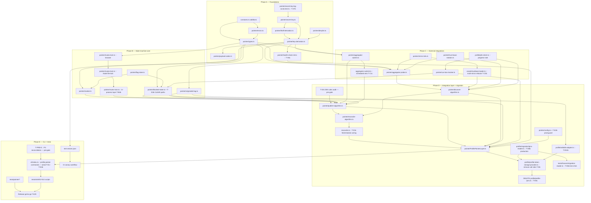

# Profile Aggregator Pointer — Implementation Plan

**Status:** Draft 4 — steelman round 2: 7 critical structural fixes applied
**Spec:** [`PROFILE-AGGREGATOR-POINTER-SPEC.md`](./PROFILE-AGGREGATOR-POINTER-SPEC.md) (v3.3)
**Architecture:** [`PROFILE-AGGREGATOR-POINTER-ARCHITECTURE.md`](./PROFILE-AGGREGATOR-POINTER-ARCHITECTURE.md) (v3.3)
**Test Spec:** [`PROFILE-AGGREGATOR-POINTER-TEST-SPEC.md`](./PROFILE-AGGREGATOR-POINTER-TEST-SPEC.md) (v2, 146 scenarios)
**Audit:** [`PROFILE-AGGREGATOR-POINTER-PLAN-AUDIT.md`](./PROFILE-AGGREGATOR-POINTER-PLAN-AUDIT.md)

---

## §1 Executive Summary

Build a new `profile/aggregator-pointer/` module that **replaces** the IPNS-based snapshot channel (`profile/profile-ipns.ts`) as the sole cold-start recovery mechanism for OrbitDB Profile OpLog CIDs. IPNS is fully removed — there is no fallback, no `--no-pointer` flag, and no legacy IPNS runtime path. The `profile-ipns.ts` file survives only as a one-shot migration reader (T-D6b), then is explicitly deleted (T-D6c). This decision is load-bearing and not reversible within this plan.

The implementation is:

- **Pure-greenfield** at the module level (new files under `profile/aggregator-pointer/`), with surgical edits to `profile/profile-token-storage-provider.ts` (remove call sites only in T-D6; migration logic extracted to `profile/migration/ipns-reader.ts` — production code, NOT tests/fixtures) and migration + deletion of `profile/profile-ipns.ts`. Migration is **Option A** (auto-triggered): `ProfilePointerLayer.init()` detects a legacy wallet and runs the one-shot IPNS→pointer migration automatically; `tests/fixtures/migration-reader.ts` is a thin test shim that imports `profile/migration/ipns-reader.ts` directly.
- **SDK-native**: all crypto round-trips via `@unicitylabs/state-transition-sdk` (`SigningService.createFromSecret`, `DataHasher`, `DataHash`, `RequestId.createFromImprint`, `Authenticator.create`, `AggregatorClient.submitCommitment`, `InclusionProof.verify`, `RootTrustBase`). Aggregator client access routes exclusively through `OracleProvider.getAggregatorClient()` — no separate instantiation.
- **Byte-exact** with canonical test vectors (SPEC §14) locking derivations; HKDF info strings, salt, IKM source, and output lengths are pinned verbatim in task acceptance criteria (not deferred to spec reference).
- **Shared trust base** with `OracleProvider` / `UnicityAggregatorProvider` (SPEC §8.4.2, H6).

**Order of build (5 phases, with pre-D gate):** A Foundations → B State-machine core → C External integrations → D Integration layer + migration (gated by T-D0 JOIN-rules audit) → E CLI + tests (gated by T-PRE-E P3 reconciliation). Phase ordering is enforced; see §8 for slot dependencies.

**Effort estimate:** 7–9 person-weeks of focused work, compressed to ≈ 2.5 calendar weeks under parallel execution. Scope risk is low (spec frozen). External-blocker risk (O-2, O-6, O-7) and two pre-phase blockers (T-D0, T-PRE-E) are the dominant schedule risk.

**Risk level:** **Medium-High**. Cryptographic module (OTP + zeroization), 146 conformance tests, 5 external blockers, worker_threads mutex gap (R-17), lock-ordering invariant (R-18), TEST-SPEC P3 orphan (R-19), JOIN rules assumption (R-20), WeakSet registry gap (R-21). Mitigations enumerated in §6.

**Total tasks: 77** (68 from v2 + 9 new).

---

## §2 Module Dependency Graph



**Critical path (longest chain):**
`constants.ts → types.ts → hkdf-derivation.ts → key-derivation.ts → aggregator-submit.ts → scheduled-zero → publish-algorithm.ts → reconcile-algorithm.ts → reconcile-wiring → ProfilePointerLayer.ts → WIRE → migration-reader → delete-ipns → CLI (serial) → N-scripts → go/no-go`

Estimated depth: 15 nodes.

---

## §3 Phase Breakdown

### Phase A — Foundations (SPEC §3, §4, §5, §11.12)

**Scope:** constants, HKDF primitives, key derivation, payload encoding, HEALTH_CHECK_REQUEST_ID derivation, error taxonomy (30 codes), type surface, `MasterPrivateKey` branded newtype, secret-key wrapper + log-scrub test, denylist. Zero runtime dependencies beyond `@noble/hashes` and `@unicitylabs/state-transition-sdk`.

**Deliverables:**
- `constants.ts` additions — all SPEC §3 constants verbatim; `IPNS_RESOLVE_TIMEOUT_MS` retained pending SPEC editor O-3 decision (T-A1c)
- `pointer/errors.ts` — all 30 error codes with stable string codes (§12)
- `pointer/types.ts` — `PointerLayerConfig`, `PublishResult`, `RecoverResult`, `Marker`, `OriginatedTag`, `ClassifyResult`, event types, `MasterPrivateKey` branded newtype
- `pointer/hkdf-derivation.ts` — `hkdfSha256(ikm, info, L)` with inline byte-exact info strings (root = 33 bytes ASCII, subkeys = 26 bytes each), salt = `new Uint8Array(0)`, pairwise distinctness KAT
- `pointer/key-derivation.ts` — `derivePointerKeyMaterial(masterKey: MasterPrivateKey)` returning `{ signingService, signingPubKey, xorSeed, padSeed }` via `SigningService.createFromSecret` only
- `pointer/payload-codec.ts` — `deriveStateHash` (bare SHA-256), `deriveXorKey` (bare SHA-256), `derivePadding` (HKDF-Expand), `buildFullBuffer`, `splitHalves`, `xorMask`, `decodePayload`
- `pointer/health-check-rid.ts` — `deriveHealthCheckRequestId` (T-A6c), KAT vector pinned
- `pointer/secret-key.ts` — `SecretKey` wrapper with full redaction (T-A7)
- `tests/integration/pointer/log-scrub.test.ts` — poisoned console transport (T-A7b)
- `pointer/denylist.ts` — non-ignorable abort on §14.1 test key
- `test-vectors.json` + `.sha256` — all §14.2, §14.5 rows + health-check RID KAT

**Parallel streams:**
1. Constants + errors + types (single typescript-pro agent; serial for internal consistency)
2. HKDF + key derivation + `MasterPrivateKey` newtype (security-auditor; S2–S4 sequential)
3. Payload codec + health-check-rid (security-auditor; depends on stream 2; S4)
4. SecretKey + denylist (security-auditor; S2, parallel with stream 2)
5. Log-scrub integration test (test-automator + security-auditor co-review; depends on stream 4; S6)
6. Test-vector generator script + CI workflow (test-automator; depends on stream 3 being locked; S5)

**Gate criteria (to enter Phase B):**
- All SPEC §3 constants exported verbatim; `grep -F` against spec returns zero diffs
- `grep -c "AGGREGATOR_POINTER_" errors.ts` returns exactly 30
- Vector-1 + Vector-2 hex-identical to SPEC §14 (diff output empty)
- `.sha256` CI check green; one forced-drift failure demonstrated and caught
- HKDF info string byte-length assertions (33 + 26 × 3) pass as unit tests
- P4 AST-grep broadened pattern (`SigningService.create(`, `new SigningService(`, alias patterns) returns zero
- P8 HKDF KAT: test IDs `P8-kdf-1` + `P8-kdf-2` green
- Log-scrub test (T-A7b): zero magic bytes in any output stream
- `MasterPrivateKey` newtype: passing raw `Uint8Array` to `derivePointerKeyMaterial` fails at compile time
- `typecheck` + `lint` clean for all Phase-A files

---

### Phase B — State-machine core (SPEC §7.1, §10.2)

**Scope:** crash-safety marker, mutex discipline (browser Web Locks + Node `proper-lockfile` + in-process `async-mutex` layer stacked above file lock), BLOCKED flag persistence (SET path here; CLEAR paths implemented in T-D3b at Phase D), originated-tag semantic validation with all 12 enum members pinned.

**Deliverables:**
- `pointer/flag-store.ts` — per-wallet key scoping (`hex(signingPubKey)`), durable writes, `AGGREGATOR_POINTER_UNSUPPORTED_RUNTIME` on non-durable backends
- `pointer/marker.ts` — `readMarker`/`writeMarker`/`clearMarker`; H13 idempotent-retry logic; `MARKER_MAX_JUMP = 1024` clamp; §7.1.5 integrity check; §7.1.6 atomicity; key = `"profile.pointer.publish.lock." + hex(signingPubKey)` exact
- `pointer/mutex-lock.ts` browser — Web Locks API with `AGGREGATOR_POINTER_UNSUPPORTED_RUNTIME` fallback; identity-switch queuing (W5)
- `pointer/mutex-lock.ts` Node file-lock — `proper-lockfile` at `<dataDir>/profile/<hex(signingPubKey)>/publish.lock`; 8000ms stale + PID liveness check
- `pointer/mutex-lock.ts` in-process layer (T-B4b) — `async-mutex` `Mutex` stacked above file lock; acquisition order: in-process first, file second; LIFO release; stress test 10+ processes × 10+ worker_threads
- `pointer/blocked-state.ts` — SET path; `BLOCKED_FLAG_KEY = "profile.pointer.blocked." + hex(signingPubKey)`; categorical-error classifier; wallet-wide scope assertion
- `pointer/originated-tag.ts` — all 9 user-action types + 3 system types enumerated; fail-closed on missing

**Parallel streams:**
1. FlagStore + Marker (backend-architect; tightly coupled; S7–S8)
2. Mutex browser (typescript-pro; S7)
3. Mutex Node file-lock (typescript-pro; S8)
4. Mutex in-process layer (typescript-pro + security-auditor; S9; depends on stream 3)
5. BlockedState SET path (backend-architect; S8)
6. OriginatedTag (security-auditor; S7; independent)
7. Unit tests: marker crash scenarios (T-B7) + mutex contention + lock-order spy (T-B8) (test-automator; S10)

**Gate criteria (to enter Phase C):**
- B1–B11 crash-scenario tests all pass (all 11 test IDs listed in Vitest output)
- Worker_threads contention test `mutex-wt-1`: two threads race, one wins, zero deadlock
- Lock-order spy test `mutex-order-1`: in-process Mutex acquired strictly before file lock; LIFO release verified
- Stress test `mutex-stress-1`: 10+ processes × 10+ worker_threads, zero failures
- `AGGREGATOR_POINTER_UNSUPPORTED_RUNTIME` on non-durable backend: test `B12` green
- BLOCKED wallet-scope `L7-precursor`: BLOCKED from HD index 0 visible from HD index 1
- K1–K10 originated-tag tests pass; all 12 enum members present in `OriginatedTag` type (grep count)
- Lockfile path verified to be exactly `<dataDir>/profile/<hex>/publish.lock` in test output

---

### Phase C — External integrations (SPEC §6, §8, §10.7)

**Scope:** aggregator submit with full H8 state-machine (genuine vs idempotent REJECTED) and both zeroization paths; aggregator probe with `classifyVersion` three-way; multi-mirror TOFU + `trustbase-loader.ts` full refactor from single-mirror; trust-base rotation with atomic pin replacement; CAR loss tracker with wired gossipsub; IPFS client H10 amendments.

**Deliverables:**
- `pointer/aggregator-submit.ts` (T-C1) — 13 §7.3 rows; H8 state-machine table; `OracleProvider.getAggregatorClient()` routing only; no direct `AggregatorClient` construction
- `aggregator-submit.ts` finally-zero (T-C1b) — `Uint8Array.fill(0)` in `finally` block; honest acceptance: documents SDK internal-copy residual risk (R-11)
- `aggregator-submit.ts` scheduled-zero (T-C1c) — `setTimeout(() => buf.fill(0), 500)` on retry-window ciphertext; non-suppressible
- `pointer/aggregator-probe.ts` (T-C2) — H2 OR-predicate; `classifyVersion` returning `VALID` / `SEMANTICALLY_INVALID` / `TRANSIENT_UNAVAILABLE`; `isReachable` via `deriveHealthCheckRequestId`
- `pointer/mirror-tofu.ts` (T-C3) — `MIN_MIRROR_COUNT = 2`; byte-identical cross-mirror check (necessary but not sufficient); cert pin H9; IP + CA diversity
- `oracle/trustbase-loader.ts` refactor (T-C3b) — single-mirror replaced with multi-mirror; atomic pin rewrite; crash-between-phases test `C3b-crash-1`
- `pointer/trust-base-rotation.ts` (T-C4) — epoch monotonicity; atomic rotation; crash-between-rotation test; H6 shared-base via `getPinnedTrustBase()`
- `pointer/car-loss-tracker.ts` (T-C5) — persistent-retry ledger wall-clock enforced; gossipsub/Nostr listener wired via `NostrTransportProvider` (peer-advertisement schema agreed before merge); H7 republish-before-advance
- `profile/ipfs-client.ts` amendments (T-C6) — H10 three-tier timeout; HTTP Range resume; `Content-Encoding` rejection; D6 byte-cap

**Parallel streams:**
1. aggregator-submit + T-C1b + T-C1c (security-auditor primary, backend-architect assists; S11–S12; serialize T-C1b and T-C1c after T-C1)
2. aggregator-probe + classifyVersion (backend-architect; S11)
3. mirror-tofu (security-auditor; S11) → trustbase-loader refactor (T-C3b; S12; same-file: serialize T-C3b after T-C3)
4. trust-base-rotation (security-auditor; S12; depends on T-C3b)
5. car-loss-tracker (backend-architect; S11)
6. ipfs-client amendments (typescript-pro; S11)
7. oracle getter T-C7 (backend-architect; S11)
8. Unit tests T-C8, T-C9, T-C10 (test-automator × 3; S13)

**Gate criteria (to enter Phase D):**
- All 13 §7.3 outcome rows have named unit tests with distinct test IDs
- H8-genuine + H8-idempotent test cases both green and verified to exercise distinct branches (not same path)
- Zero `new AggregatorClient(` in `profile/aggregator-pointer/` — security-auditor code review sign-off
- T-C1b: finally-zero test green even on throw path
- T-C1c: scheduled-zero test: non-zero at t=0, zero at t=510ms
- D14 single-mirror-abort test green; `C3b-crash-1` crash-atomicity test green
- T-C4 crash-between-rotation-phases test green
- CAR loss: G2 republish-before-advance test green; gossipsub listener integration confirmed (not stub); peer-advertisement schema agreed with NostrTransportProvider author
- D5/D6/D7 IPFS client tests green
- `classifyVersion` three-way: E6 (VALID) + E7 (SEMANTICALLY_INVALID) + E8 (TRANSIENT_UNAVAILABLE) green

---

### Phase D — Integration layer + migration (SPEC §7, §8.2, §9, §13, ARCH §15)

**Pre-gate: T-D0 (JOIN rules audit) must be DONE and gap report closed before any D-series task begins.**

**Scope:** top-level publish/discover algorithms; reconcile algorithm with explicit fetchAndJoin + version-write wiring (T-D3c) and BLOCKED CLEAR paths (T-D3b); public API with `getProbeFingerprint` KAT; configuration with production-build guard; call-site removal (T-D6, NOT method deletion); migration reader in `profile/migration/ipns-reader.ts` (production code — Option A auto-trigger) with test shim in `tests/fixtures/migration-reader.ts` (T-D6b); `profile-ipns.ts` deletion (T-D6c); adapter-level originated-tag downgrade (T-D11b); W11 originated-tag migrations across all modules; bundle duplication check.

**Critical sequencing:**
- T-D3 (S16a) → T-D3b (S16b) → T-D3c (S17) → T-D4 (S18): four strictly sequential sub-slots; T-D3b cannot start until T-D3 is complete; T-D4 cannot start until T-D3c is complete
- T-D4 must be stable before T-D7–T-D11b (W11 migrations reference API types)
- T-D6 (call-site removal only) → T-D6b (migration reader in `profile/migration/ipns-reader.ts`, auto-triggered by `ProfilePointerLayer.init()` on legacy-wallet detection) → T-D6c (deletion of `profile/profile-ipns.ts`) are strictly sequential
- T-D11 must serialize after T-D6 on `profile-token-storage-provider.ts` (same file)

**Deliverables:**
- `pointer/publish-algorithm.ts` — §7.1 critical-section + §7.2 payload + §7.3 parallel submit + §7.4 backoff; H4 `max(validV, includedV)+1` on conflict
- `pointer/discover-algorithm.ts` — §8.2 three-phase; returns `{ validV, includedV }`; W7 walkback floor; `DISCOVERY_CORRUPT_WALKBACK` bail
- `pointer/reconcile-algorithm.ts` (T-D3) — §9 conflict handling; PUBLISH_RETRY_BUDGET enforcement; R-14 reset-semantics pin test `reconcile-retry-reset-1`
- BLOCKED CLEAR paths (T-D3b) — path (a): v=1 `PATH_NOT_INCLUDED` exclusion proof on both sides A+B; path (b): `recoverLatest() > 0` + CAR + OpLog merge; integration test `reconcile-blocked-clear-1`
- fetchAndJoin wiring (T-D3c) — explicit `profileLayer.fetchAndJoin(remote.cid)` + `storage.write("profile.pointer.version", validV)` calls wired in reconcile success path
- `pointer/ProfilePointerLayer.ts` (T-D4) — SPEC §13 verbatim method signatures; `getProbeFingerprint` formula (SHA-256 over sorted probe-version-list, truncated to 8 bytes hex) + KAT pinned; no `disablePointer`
- `pointer/config.ts` (T-D5) — `allowUnverifiedOverride` raises `CAPABILITY_DENIED` at init (O-5 deferral)
- Production-build guard (T-E26) — throws `CAPABILITY_DENIED` at init if production mode + overrides enabled
- `profile-token-storage-provider.ts` call-site removal only (T-D6) — removes call sites at lines 279 + 879; deletes private method bodies 975–1046; bodies go to `profile/migration/ipns-reader.ts`, NOT to tests
- `profile/migration/ipns-reader.ts` + `tests/fixtures/migration-reader.ts` (T-D6b, **Option A auto-trigger**) — production module `profile/migration/ipns-reader.ts` contains `runIpnsToPointerMigration()`; `ProfilePointerLayer.init()` auto-calls it on legacy-wallet detection (`storage.get("profile.ipns.sequence") !== null AND storage.get("profile.pointer.migration.done") === undefined`); reads IPNS snapshot, publishes via `ProfilePointerLayer.publish()`, verifies `TokenConservationInvariant.assert`, writes `profile.pointer.migration.done`; `tests/fixtures/migration-reader.ts` is a test-only shim importing the production module
- Delete `profile/profile-ipns.ts` (T-D6c) — removal verified by `git ls-files` + targeted `git grep`
- `profile/orbitdb-adapter.ts` originated-tag downgrade (T-D11b) — before `OpLog.append()`
- W11 originated-tag stamps in `PaymentsModule`, `AccountingModule`, `SwapModule`, `CommunicationsModule`, `profile-token-storage-provider`
- `oracle/UnicityAggregatorProvider.ts` getter amendment (T-C7)
- Bundle duplication check (T-D12b) — identity equality OR explicit dual-configure pattern required; no "document only" escape hatch

**Gate criteria (to enter Phase E):**
- T-D0 gap report: all PROFILE-ARCHITECTURE.md §10.4 JOIN rules 1–5 verified present; gaps closed; security-auditor sign-off
- Publish + recover round-trip integration test green (mock aggregator + in-mem IPFS)
- Migration test: token conservation holds before + after; `profile.pointer.migration.done` present post-run
- `git ls-files profile/profile-ipns.ts` returns empty
- `git grep 'profile-ipns' -- '*.ts' '*.js' ':!docs/' ':!tests/fixtures/'` returns empty
- `git grep "OpLog.write\|OpLog.append" -- '*.ts' | grep -v "originated:"` returns empty
- Adapter downgrade: security-auditor code review confirms downgrade occurs before `OpLog.append()`
- `.d.ts` comparison script exits 0: method signatures byte-for-byte match SPEC §13 literal
- `getProbeFingerprint` KAT vector green (T-A9 pinned)
- H6 getter: `getPinnedTrustBase()` present in `UnicityAggregatorProvider.d.ts`
- T-D12b bundle check passes (identity equality or dual-configure implemented)
- O-2 CI guard: PR with `"O-2-UNRESOLVED"` in config triggers failure (demonstrated)
- T-E26 production-build guard: throws `CAPABILITY_DENIED` in production mode with overrides (test green)

---

### Phase E — CLI + tests (SPEC §13 API, TEST-SPEC §2–§7)

**Pre-gate: T-PRE-E (P3 reconciliation) must be DONE and decision documented before any E-series test task begins.**

**Scope:** CLI commands (strictly serialized single agent on `cli/index.ts`); unit-test categories A, B, E, F, K, L; integration-test categories C, D, G, H, I, J, M; conformance P1–P8 (P1 runtime instrumentation, P4 broadened AST-grep); N-scripts N1–N14 (N14 auto-triggers migration via `ProfilePointerLayer.init()`; test shim in `tests/fixtures/migration-reader.ts` re-exports from production `profile/migration/ipns-reader.ts`); token-conservation harness pre-frozen as shared fixture (T-E21 before S28 begins); CI canary + version-read guard; coverage-matrix audit; runbook; release go/no-go checkpoint.

**CLI serialization:** T-E1 → T-E2 → T-E3 → T-E4 → T-E4b are strictly sequential (single typescript-pro agent; all edit `cli/index.ts`; one combined PR). No parallel CLI edits permitted.

**Parallel test streams (after T-PRE-E + T-E21 committed):**
1. Unit-test categories A, B, E, F, K, L — 6 parallel test-automator agents (S27)
2. Integration-test categories C, D, G, H, I, J, M — 7 parallel test-automator agents (S28); T-E21 harness must be committed before this slot
3. Conformance P1–P8 + N-scripts N1–N14 (S29; security-auditor + bash-pro)
4. CI canary + T-E22b version guard + coverage audit + runbook (S30; test-automator × 3 + doc-gen)
5. T-E25 go/no-go (S31; coordinator; depends on all prior E slots green)

**Gate criteria (DONE):**
- T-PRE-E decision documented; TEST-SPEC updated; no orphaned P3 test IDs
- T-E21 token-conservation harness committed before S28 (pre-freeze verification)
- 100% Category P (P1–P8; P3 per T-PRE-E decision; P4 broadened AST-grep pattern)
- ≥ 95% Categories A–O; all skipped items carry SPEC reference + risk disclosure
- N1, N2, N5, N6, N7, N7b, N13, N14 green on real testnet
- N14: log confirms IPNS code path invoked exactly once (migration step only); `profile.pointer.migration.done` present; token conservation holds
- Coverage-matrix audit (T-E23) exits 0; zero H/W gaps
- Token Conservation Invariant: zero violations across full suite
- All four CLI commands present; `cli-flush-1` integration test green
- `grep "no-pointer\|profile-ipns" cli/index.ts` returns empty
- T-E22b version-read guard green
- T-E25 go/no-go: security-auditor + backend-architect sign-off; `"O-2-UNRESOLVED"` absent from all config files; 2-week testnet soak documented

---

## §4 Task Decomposition

Legend: ⚑ = security-auditor MANDATORY co-reviewer. **P-group** = parallel-dispatch group. **SPEC ref** cites normative section.

| Task ID | Phase | P-group | File path | Agent | Depends on | Acceptance | SPEC ref |
|---|---|---|---|---|---|---|---|
| T-A1 | A | A-1 | `constants.ts` (edit) | typescript-pro | — | All §3 constants exported; values match verbatim; `IPNS_RESOLVE_TIMEOUT_MS` present only if SPEC §3 retains it (T-A1c judgment: include with comment "retained pending O-3 IPNS-removal audit") | §3 |
| T-A2 | A | A-1 | `profile/aggregator-pointer/errors.ts` | typescript-pro | T-A1 | All 30 error codes from SPEC §12: `AGGREGATOR_POINTER_CONFLICT`, `_STALE`, `_CORRUPT`, `_NOT_FOUND`, `_PARTIAL`, `_REJECTED`, `_RETRY_EXHAUSTED`, `_CID_TOO_LARGE`, `_VERSION_OUT_OF_RANGE`, `_DISCOVERY_OVERFLOW`, `_NETWORK_ERROR`, `_UNTRUSTED_PROOF`, `_UNREACHABLE_RECOVERY_BLOCKED`, `_TRUST_BASE_DIVERGENCE`, `_MARKER_CORRUPT`, `_CAR_TOO_LARGE`, `_CAR_FETCH_TIMEOUT`, `_CAR_UNAVAILABLE`, `_CORRUPT_STREAK`, `SECURITY_ORIGIN_MISMATCH`, `_UNSUPPORTED_RUNTIME`, `_PUBLISH_BUSY`, `_TRUST_BASE_STALE`, `_CERT_PIN_MISMATCH`, `_MIRROR_LIST_TAMPERED`, `_CAR_UNEXPECTED_ENCODING`, `_AGGREGATOR_REJECTED`, `_PROTOCOL_ERROR`, `_WALKBACK_FLOOR`, `_CAPABILITY_DENIED`; `grep -c "AGGREGATOR_POINTER_" errors.ts` returns 30 | §12 |
| T-A3 | A | A-1 | `profile/aggregator-pointer/types.ts` | typescript-pro | T-A2 | `PointerLayerConfig`, `PublishResult`, `RecoverResult`, `Marker`, `OriginatedTag`, `ClassifyResult`, event types; `MasterPrivateKey` branded newtype (see T-A5b) | §13, §10.2 |
| T-A4 ⚑ | A | A-2 | `profile/aggregator-pointer/hkdf-derivation.ts` | security-auditor | T-A1 | `hkdfSha256(ikm, info, L)` wrapping `@noble/hashes/hkdf`; IKM = BIP32 master private key scalar (32 bytes); salt = empty (`new Uint8Array(0)`); root info = `"uxf-profile-aggregator-pointer-v1"` (33 bytes ASCII, per H12); signing subkey info = `"uxf-profile-pointer-sig-v1"` (26 bytes); xor subkey info = `"uxf-profile-pointer-xor-v1"` (26 bytes); pad subkey info = `"uxf-profile-pointer-pad-v1"` (26 bytes); KAT: with IKM = `01`×32, root output prefix first 4 bytes pinned to `[0xXX, 0xXX, 0xXX, 0xXX]` from SPEC §14.2 (fill from T-A9 computation); pairwise distinctness of all four subkeys asserted in unit test; `PROFILE_POINTER_HKDF_INFO` byte-length assertion = 33 | §2.1, §4.1 |
| T-A5b ⚑ | A | A-2 (S3a) | `profile/aggregator-pointer/types.ts` + `core/Sphere.ts` (edit) | security-auditor | T-A4 | `MasterPrivateKey` branded newtype (`{ readonly _brand: 'MasterPrivateKey'; readonly bytes: Uint8Array }`); `MasterPrivateKey.createFromWalletRoot(ikm, walletRootContext)` is the **only exported constructor**; `Sphere.init()` / `Sphere.load()` / `Sphere.create()` / `Sphere.import()` each call `createFromWalletRoot` and add the instance to a `WeakSet<MasterPrivateKey>` registry; `derivePointerKeyMaterial` checks the registry at entry and throws `AGGREGATOR_POINTER_PROTOCOL_ERROR` if the instance is not registered; unit test: pass a cast object matching the shape but not registered → must throw; prevents child-key substitution at both compile time (type mismatch) and runtime (registry miss) | §4.1 W1 |
| T-A5 ⚑ | A | A-2 (S3b) | `profile/aggregator-pointer/key-derivation.ts` | security-auditor | T-A5b | `derivePointerKeyMaterial(masterKey: MasterPrivateKey): PointerKeyMaterial`; returns `{ signingService, signingPubKey, xorSeed, padSeed }`; `signingService` via `SigningService.createFromSecret(signingSeed)` only; byte-matching §14.2; depends on T-A5b type definition | §4.2–§4.3 |
| T-A6 ⚑ | A | A-2 | `profile/aggregator-pointer/payload-codec.ts` | security-auditor | T-A5 | `deriveStateHash` uses `DataHasher(SHA256).update(v_bytes).update(cidBytes).digest()` (bare SHA-256, NOT HKDF-Expand); `deriveXorKey` uses `DataHasher(SHA256).update(xorSeed).update(side_byte).update(v_bytes).digest()` (bare SHA-256, NOT HKDF-Expand); `derivePadding` uses HKDF-Expand from `padSeed`, info=`"pad"||side_byte||v_bytes`, L=32; `buildFullBuffer`, `splitHalves`, `xorMask`, `decodePayload` byte-identical to §4.4–§5.4; Vector-1 xorKey_A_v1 hex pinned in acceptance from T-A9 output | §4.4–§5.4 |
| T-A6c ⚑ | A | A-2 | `profile/aggregator-pointer/health-check-rid.ts` | security-auditor | T-A5 | `deriveHealthCheckRequestId(signingPubKey: Uint8Array): RequestId`; formula: `SHA-256("profile-pointer-health-check" || signingPubKey)` (64 bytes total if pubkey 33 bytes); wraps result as `RequestId.createFromImprint(sha256output)`; KAT: with signingPubKey = all-0x01 bytes (33 bytes), output RequestId imprint hex pinned from T-A9 vector computation; unit test asserts determinism; `HEALTH_CHECK_REQUEST_ID` is a **derived value, not a constant** — note to SPEC editor: propose adding derivation formula to SPEC §3 constants table, or document as derived-only in SPEC §13 `isReachable` description | §13 W12 |
| T-A7 ⚑ | A | A-3 | `profile/aggregator-pointer/secret-key.ts` | security-auditor | T-A3 | `SecretKey` wrapper; `toString()` → `"[redacted]"`; `toJSON()` → `"[redacted]"`; `util.inspect.custom` → `"SecretKey([redacted])"`; denylist check on construction (§14.1 key); `console.log(sk)` test verifies redaction | §11.11 |
| T-A7b ⚑ | A | A-3 | `tests/integration/pointer/log-scrub.test.ts` | test-automator + security-auditor | T-A7 | Poisoned console transport (intercepts all `console.*` + `process.stdout/stderr`); runs full publish flow with magic-valued `signingPubKey` bytes (`0xDE 0xAD 0xBE...`); asserts no log, error message, or stack-trace string contains those bytes in any encoding (hex, base64, raw); separate from T-A7 toString test | §11.11 |
| T-A8 ⚑ | A | A-3 | `profile/aggregator-pointer/denylist.ts` | security-auditor | T-A5 | §14.1 key (`01`×32) denylisted on all networks except `'test-vectors'`; abort is non-ignorable (throws, not warns); test ID `L1`, `L2` cover denylist + allowed-on-test-vectors | §11.12 |
| T-A9 | A | A-4 | `scripts/compute-pointer-test-vectors.ts` + `docs/uxf/profile-aggregator-pointer.test-vectors.json` + `.sha256` | test-automator | T-A6, T-A6c | Computes all §14.2 + §14.5 rows + HEALTH_CHECK_REQUEST_ID KAT values; fills pinned hex values referenced in T-A4, T-A6, T-A6c acceptance criteria; checksum reproducible | §14, O-1 |
| T-A10 | A | A-4 | `.github/workflows/pointer-vectors.yml` | test-automator | T-A9 | CI verifies `.sha256` on every PR; fails on drift; fails with explicit message `"ERROR: O-2-UNRESOLVED — RootTrustBase source must be specified before shipping"` if literal `"O-2-UNRESOLVED"` present in any config file | §15.1 O-7 |
| T-B1 | B | B-1 | `profile/aggregator-pointer/flag-store.ts` | backend-architect | T-A3 | Per-wallet scoping via `hex(signingPubKey)`; durable writes (IndexedDB `transaction.oncomplete` / Node `fsync`); `AGGREGATOR_POINTER_UNSUPPORTED_RUNTIME` on non-durable backends; test verifies backend-verification at init | §7.1.2, §7.1.3 |
| T-B2 ⚑ | B | B-1 | `profile/aggregator-pointer/marker.ts` | backend-architect | T-B1 | `readMarker`/`writeMarker`/`clearMarker`; H13 idempotent-retry branch; rollback-safe bump; `MARKER_MAX_JUMP` clamp; §7.1.5 integrity check; §7.1.6 atomicity; key = `"profile.pointer.publish.lock." + hex(signingPubKey)` (SPEC §3 `MUTEX_KEY` template) | §7.1.4–§7.1.6 |
| T-B3 ⚑ | B | B-2 | `profile/aggregator-pointer/mutex-lock.ts` (browser) | typescript-pro | T-A3 | Web Locks API; `AGGREGATOR_POINTER_UNSUPPORTED_RUNTIME` fallback; queued on identity switch (W5) | §7.1.1 |
| T-B4 ⚑ | B | B-2 | `profile/aggregator-pointer/mutex-lock.ts` (Node, file lock) | typescript-pro | T-A3 | `proper-lockfile` at `<dataDir>/profile/<hex(signingPubKey)>/publish.lock` (exact SPEC §7.1.1 path template); 8000ms stale + PID liveness check | §7.1.1 |
| T-B4b ⚑ | B | B-2 | `profile/aggregator-pointer/mutex-lock.ts` (Node, in-process layer) | typescript-pro + security-auditor | T-B4 | Stack `async-mutex` `Mutex` above `proper-lockfile`; acquisition order: in-process Mutex first, file lock second (R-18: lock ordering); release order LIFO (file lock released first, then in-process Mutex); verified by spy-instrumented unit test asserting acquire/release sequence; stress test: 10+ processes × 10+ worker_threads, zero deadlocks, zero missed acquires; `AGGREGATOR_POINTER_PUBLISH_BUSY` raised correctly on timeout | §7.1.1, R-17, R-18 |
| T-B5 ⚑ | B | B-3 | `profile/aggregator-pointer/blocked-state.ts` | backend-architect | T-B1 | `isBlocked`/`setBlocked`/`clearBlocked`; categorical-error classifier (timeout, DNS, TLS); BLOCKED flag key = `"profile.pointer.blocked." + hex(signingPubKey)`; wallet-wide (same signingPubKey across all HD addresses); survives process restart; test: derive pointer identity from HD indices 0 and 1, assert same `signingPubKey` bytes, assert BLOCKED from index-0 is visible from index-1 (L7 precursor) | §10.2.1–§10.2.5 |
| T-B6 ⚑ | B | B-4 | `profile/aggregator-pointer/originated-tag.ts` | security-auditor | T-A3 | Stamp + semantic-validate; SPEC §10.2.3 D5 enum must include all **9 user-action types**: `token_send`, `token_receive`, `nametag_register`, `dm_send`, `invoice_mint`, `invoice_pay`, `swap_propose`, `swap_accept`, `swap_deposit`; and all **3 system types**: `session_receipt`, `cache_index`, `last_opened_ts`; `SECURITY_ORIGIN_MISMATCH` on mismatch; fail-closed on missing tag | §10.2.3–§10.2.3.1 |
| T-B7 | B | B-5 | `tests/unit/pointer/marker.test.ts` | test-automator | T-B2 | B1–B11 scenarios cover all crash-point transitions | TEST §B |
| T-B8 | B | B-5 | `tests/unit/pointer/mutex.test.ts` | test-automator | T-B4b | Cross-tab (Web Locks stub) + cross-process (Node real lockfile) + worker_threads contention (two-thread race, exactly one wins without deadlock) + lock-order spy test (instrumented spies assert in-process Mutex acquired before file lock; released in LIFO order) | TEST §3.1 |
| T-C1 ⚑ | C | C-1 | `profile/aggregator-pointer/aggregator-submit.ts` | backend-architect | T-A5, T-A6 | All 13 rows of §7.3 outcome matrix; W3 HTTP status classifier; W4 timeouts; H8 burn-v handling: state-machine table distinguishes (a) genuine REJECTED — `marker.cidHash != SHA-256(cidBytes)` OR marker absent → burn v, persist `localVersion=v`; (b) idempotent-replay — marker matches → return success without burning; each sub-case has a dedicated test ID (`H8-genuine`, `H8-idempotent`); `AggregatorClient` via `OracleProvider.getAggregatorClient()` only; `AGGREGATOR_POINTER_PROTOCOL_ERROR` if returns null | §6.5, §7.3 |
| T-C1b ⚑ | C | C-1 | `profile/aggregator-pointer/aggregator-submit.ts` (finally-zero) | security-auditor | T-C1 | H14(b) finally-zero: `Uint8Array.fill(0)` on local reference buffers `ctA`, `ctB`, `partA`, `partB` in `finally` block immediately post-submit; acceptance is **honest**: documents that SDK may retain internal copies via JSON/base64 encoding — this is a known residual risk (R-11) documented in runbook; unit test verifies zero-fill executes even on throw path | §11.11(b) |
| T-C1c ⚑ | C | C-1 | `profile/aggregator-pointer/aggregator-submit.ts` (scheduled-zero) | security-auditor | T-C1b | H14(a′) scheduled zero: `setTimeout(() => buf.fill(0), MAX_CT_RESIDENT_MS)` where `MAX_CT_RESIDENT_MS` = 500 (SPEC §3 §11.11(a′)) on any ciphertext buffer held across a retry window; unit test: buffer is non-zero at t=0, zero at t=500ms + 10ms jitter; test does not suppress the `setTimeout` | §11.11(a′) |
| T-C2 | C | C-2 | `profile/aggregator-pointer/aggregator-probe.ts` | backend-architect | T-A5, T-A6, T-A6c | H2 OR-predicate; `classifyVersion` three-way (H1); `isReachable` via `deriveHealthCheckRequestId` (W12, T-A6c output); probe fingerprint | §8.1, §8.2, §8.3, §13 W12 |
| T-C3 ⚑ | C | C-3 | `profile/aggregator-pointer/mirror-tofu.ts` | security-auditor | T-A3, T-C2 | `MIN_MIRROR_COUNT = 2` MANDATORY; byte-identical `InclusionProof.verify` responses across mirrors (necessary but not sufficient for H3 — also requires CA + IP diversity enforcement); cert pin (H9); `MIRROR_LIST_SHA256` gate; `MIRROR_CERT_PINS` check | §8.4, §8.4.3 |
| T-C3b ⚑ | C | C-3 | `oracle/trustbase-loader.ts` (full refactor) | security-auditor | T-C3 | Replace existing single-mirror implementation with multi-mirror cross-check; `MIN_MIRROR_COUNT = 2` enforced at loader level; trust-base pin rewrite is **atomic** (write new pin, verify, then replace — not in-place mutation); crash-between-phases test: process killed after write but before verify; on restart, old pin still valid (test ID `C3b-crash-1`); D14 single-mirror-bootstrap abort test green | §8.4, H3 |
| T-C4 ⚑ | C | C-3 | `profile/aggregator-pointer/trust-base-rotation.ts` | security-auditor | T-C3b | H5 rotation-vs-forgery via epoch compare; monotone epoch enforcement; H6 shared-base contract; reads trust base via `OracleProvider.getPinnedTrustBase()`; trust-base pin replacement is atomic (T-C3b pattern); crash-between-rotation-phases test | §8.4.1, §8.4.2 |
| T-C5 | C | C-4 | `profile/aggregator-pointer/car-loss-tracker.ts` | backend-architect | T-B1, T-B5 | Persistent-retry ledger (wall-clock across restarts); peer-availability poll wired to real OrbitDB gossipsub/Nostr listener via `NostrTransportProvider` (co-task with NostrTransportProvider author; peer-advertisement schema must be specified — Nostr event kind or OrbitDB topic — and agreed before T-C5 merges); H7 republish-before-advance helper | §10.7, §10.7.1 |
| T-C6 | C | C-5 | `profile/ipfs-client.ts` (edit) | typescript-pro | T-A1 | H10 three-tier timeout; HTTP Range resume; `Content-Encoding` rejection; D6 streaming byte-cap | §8.5 (H10, D6) |
| T-C7 | C | C-6 | `oracle/UnicityAggregatorProvider.ts` (edit) | backend-architect | T-C4 | Expose `getPinnedTrustBase()` + `getMirrorClients()` for H6 sharing | §8.4.2 H6 |
| T-C8 | C | C-7 | `tests/unit/pointer/submit.test.ts` | test-automator | T-C1, T-C1b, T-C1c | All §7.3 rows; H8-genuine + H8-idempotent sub-cases; finally-zero test; scheduled-zero timer test | TEST §D, §H |
| T-C9 | C | C-7 | `tests/unit/pointer/probe.test.ts` | test-automator | T-C2 | Category E + classifyVersion three-way + `isReachable` via health-check RID (W12) | TEST §E |
| T-C10 | C | C-7 | `tests/unit/pointer/mirror-tofu.test.ts` | test-automator | T-C3b | D14 (single-mirror abort), D15 (cert-pin mismatch), D16 (mirror-list tampered), H3-R sub-cases A/B/C; verify byte-identical cross-mirror check | TEST §D |
| T-D0 | D | D-0 | `docs/uxf/PROFILE-AGGREGATOR-POINTER-JOIN-AUDIT.md` | backend-architect | T-A3 | Audit `profile-token-storage-provider` + `profile/orbitdb-adapter.ts` for PROFILE-ARCHITECTURE.md §10.4 JOIN rules 1–5; produce gap report; close all gaps before Phase D entry; this task BLOCKS all other D-series tasks | PROFILE-ARCHITECTURE.md §10.4, R-20 |
| T-D1 | D | D-1 | `profile/aggregator-pointer/publish-algorithm.ts` | backend-architect | T-B2, T-B4b, T-B5, T-C1c | §7.1 critical-section + §7.2 payload + §7.3 parallel submit + §7.4 backoff; H4 `max(validV, includedV)+1` | §7 |
| T-D2 | D | D-1 | `profile/aggregator-pointer/discover-algorithm.ts` | backend-architect | T-C2 | §8.2 three-phase; returns `{ validV, includedV }`; W7 walkback floor; `DISCOVERY_CORRUPT_WALKBACK` bail | §8.2, §10.8 |
| T-D3 | D | D-2a | `profile/aggregator-pointer/reconcile-algorithm.ts` | backend-architect | T-D1, T-D2 | §9 conflict handling; PUBLISH_RETRY_BUDGET enforcement; R-14 reset-semantics pin test: unit test `reconcile-retry-reset-1` pins current behavior regardless of SPEC interpretation | §9 |
| T-D3b | D | D-2a | `profile/aggregator-pointer/blocked-state.ts` (edit) | backend-architect | T-D3 | Implement both BLOCKED CLEAR paths per SPEC §10.2.4: (a) v=1 `PATH_NOT_INCLUDED` exclusion proof verified on both sides A and B; (b) `recoverLatest() > 0` + CAR fetched + OpLog merged successfully; unit test for each path; integration test `reconcile-blocked-clear-1` | §10.2.4 |
| T-D3c | D | D-2a | `profile/aggregator-pointer/reconcile-algorithm.ts` (edit) | backend-architect | T-D3, T-D3b | Explicit wiring: `profileLayer.fetchAndJoin(remote.cid)` on reconcile success; `storage.write("profile.pointer.version", validV)` after successful join; unit test verifies both calls occur with correct arguments on a successful reconcile round | §9.2 |
| T-D4 | D | D-2b | `profile/aggregator-pointer/ProfilePointerLayer.ts` | backend-architect | T-D3c | SPEC §13 verbatim method signatures: `publish`, `recoverLatest`, `discoverLatestVersion`, `isReachable`, `isPublishBlocked`, `acceptCarLoss`, `clearPendingMarker`, `getProbeFingerprint`, `acceptCorruptStreak`; `getProbeFingerprint` formula: `SHA-256` over sorted probe-version-list, truncated to 8 bytes, returned as hex string; KAT vector pinned from T-A9 computation; `allowOperatorOverrides` gating; no `disablePointer` surface | §13 |
| T-D5 | D | D-3 | `profile/aggregator-pointer/config.ts` | typescript-pro | T-A3 | `PointerLayerConfig` with `allowOperatorOverrides`, `allowInsecureGateways`, `mirrorOverrides`; `allowUnverifiedOverride` typed but raises `AGGREGATOR_POINTER_CAPABILITY_DENIED` at init in v1 (per O-5 deferral); no `disablePointer` field | §13, W2, O-5 |
| T-D6 | D | D-4 | `profile/profile-token-storage-provider.ts` (edit: call-site removal only) | backend-architect | T-D4, T-D0 | Remove **call sites** at lines 279 + 879; wire `recoverFromAggregatorPointer` + `publishAggregatorPointerBestEffort`; delete private method bodies 975–1046 (`publishIpnsSnapshotBestEffort`, `recoverFromIpnsSnapshot`); **method bodies are NOT moved here** — they go to T-D6b fixture | ARCH §3.2, §3.3 |
| T-D6b | D | D-4 | `profile/migration/ipns-reader.ts` (new, production) + `tests/fixtures/migration-reader.ts` (test shim) | backend-architect | T-D6 | **Option A auto-trigger**: extract IPNS read logic into `profile/migration/ipns-reader.ts` (production module, not tests/); `ProfilePointerLayer.init()` calls `runIpnsToPointerMigration()` on legacy-wallet detection; detects via `storage.get("profile.ipns.sequence") !== null AND storage.get("profile.pointer.migration.done") === undefined`; reads IPNS snapshot, publishes via `ProfilePointerLayer.publish()`, verifies `TokenConservationInvariant.assert`, writes `profile.pointer.migration.done`; `tests/fixtures/migration-reader.ts` is a test-only shim that re-exports from `profile/migration/ipns-reader.ts` for N14 E2E script use | ARCH §15 |
| T-D6c | D | D-4 | `profile/profile-ipns.ts` (deletion) | typescript-pro | T-D6b | Delete `profile/profile-ipns.ts` and all imports; `git ls-files profile/profile-ipns.ts` returns empty; `git grep 'profile-ipns' -- '*.ts' '*.js' ':!docs/' ':!tests/fixtures/'` returns empty | ARCH §15.1 |
| T-D7 | D | D-5 | `modules/payments/PaymentsModule.ts` (edit) | typescript-pro | T-B6, T-D4 | Stamp `originated: 'user'` on `token_send`, `token_receive`, `nametag_register` OpLog writes | §10.2.3.1 W11 |
| T-D8 | D | D-5 | `modules/accounting/AccountingModule.ts` (edit) | typescript-pro | T-B6, T-D4 | Stamp `'user'` on `invoice_mint`, `invoice_pay`, `invoice_close` | W11 |
| T-D9 | D | D-5 | `modules/swap/SwapModule.ts` (edit) | typescript-pro | T-B6, T-D4 | Stamp `'user'` on `swap_propose`, `swap_accept`, `swap_deposit`, payout | W11 |
| T-D10 | D | D-5 | `modules/communications/CommunicationsModule.ts` (edit) | typescript-pro | T-B6, T-D4 | Stamp `'user'` on `dm_send`; `'replicated'` on `dm_receive` | W11 |
| T-D11 | D | D-5 | `profile/profile-token-storage-provider.ts` (edit, after T-D6) | typescript-pro | T-B6, T-D6 | Stamp `'system'` on batch bundle events, session/cache/index writes; serialize strictly after T-D6 on this file | W11 |
| T-D11b ⚑ | D | D-5 | `profile/orbitdb-adapter.ts` (edit) | backend-architect + security-auditor | T-B6, T-D4 | Apply receiver-authority originated-tag downgrade (`'user'` → `'replicated'`) at replication entry point, before `OpLog.append()`; security-auditor confirms ordering by code review | §10.2.3 |
| T-D12 | D | D-6 | `tests/integration/pointer/publish-recover-roundtrip.test.ts` | test-automator | T-D4, T-D6 | Full publish + recover via mock aggregator + in-mem IPFS; Category A | TEST §A |
| T-D12b | D | D-6 | `tests/build/bundle-duplication.test.ts` | typescript-pro | T-D4 | tsup build test: import `ProfilePointerLayer` from both `dist/index.js` and `dist/impl/browser/index.js`; require identity equality OR explicit dual-configure pattern (no escape-hatch "or document" — must implement one of these two options and document which); pattern per `TokenRegistry` CLAUDE.md note | CLAUDE.md |
| T-E26 | D | D-3 | `profile/aggregator-pointer/config.ts` (guard) + CI | typescript-pro + test-automator | T-D5 | Production-build guard: if `process.env.NODE_ENV === 'production'` (or tsup production flag) AND (`allowInsecureGateways === true` OR `allowOperatorOverrides === true`), throw `AGGREGATOR_POINTER_CAPABILITY_DENIED` at `ProfilePointerLayer` init; CI test: build with production flag + enabled overrides → assert init throws | §13 |
| T-PRE-E | E | pre-E | `docs/uxf/` (SPEC + TEST-SPEC edits or issue) | backend-architect | T-D4 | Reconcile P3 TEST-SPEC orphan: P3 references `AGGREGATOR_POINTER_PROOF_STALE` and `MAX_PROOF_AGE` which appear in neither SPEC §3 nor §12; resolution options: (a) remove P3 from TEST-SPEC and close test slot, OR (b) add `AGGREGATOR_POINTER_PROOF_STALE` to SPEC §12 and `MAX_PROOF_AGE` to SPEC §3, plus add derivation + test tasks; decision must be agreed with SPEC editor; this task BLOCKS all E-series test tasks (R-19) | TEST-SPEC P3, R-19 |
| T-E1 | E | E-1 (serial) | `cli/index.ts` (edit) — add `profile pointer status` | typescript-pro | T-D4, T-PRE-E | Prints `localVersion`, `isBlocked`, probe fingerprint | TEST App E |
| T-E2 | E | E-1 (serial) | `cli/index.ts` (edit) — add `profile pointer recover` | typescript-pro | T-E1 | Invokes `recoverLatest()`; surfaces errors | TEST App E |
| T-E3 | E | E-1 (serial) | `cli/index.ts` (edit) — add `profile unblock` | typescript-pro | T-E2 | Routes to `clearPendingMarker` / `acceptCarLoss` / `acceptCorruptStreak` based on state | TEST App E |
| T-E4 | E | E-1 (serial) | `cli/index.ts` (edit) — remove legacy IPNS references | typescript-pro | T-E3 | Confirm no `--no-pointer` flag, no IPNS fallback, no `profile.ipns.*` commands; `grep "no-pointer\|ipns" cli/index.ts` returns empty | — |
| T-E4b | E | E-1 (serial) | `cli/index.ts` (edit) — verify/implement `profile flush` | typescript-pro | T-E4 | `sphere profile flush` command is present and calls `publish()`; integration test `cli-flush-1` green (not conditional on whether it existed before) | TEST App E |
| T-E5 | E | E-2 | `tests/unit/pointer/category-A.test.ts` | test-automator | T-D12, T-PRE-E | A1–A5 all green | TEST §A |
| T-E6 | E | E-2 | `tests/unit/pointer/category-B.test.ts` | test-automator | T-B7, T-PRE-E | B1–B11 (consolidate with T-B7) | TEST §B |
| T-E7 | E | E-2 | `tests/unit/pointer/category-E.test.ts` | test-automator | T-C9, T-PRE-E | E1–E13 + E5b | TEST §E |
| T-E8 | E | E-2 | `tests/unit/pointer/category-F.test.ts` | test-automator | T-C4, T-PRE-E | F1–F9 trust-base | TEST §F |
| T-E9 | E | E-2 | `tests/unit/pointer/category-K.test.ts` | test-automator | T-B6, T-PRE-E | K1–K10 originated-tag; verify all 12 enum members covered | TEST §K |
| T-E10 | E | E-2 | `tests/unit/pointer/category-L.test.ts` | test-automator | T-A8, T-PRE-E | L1–L7 identity/key handling; L7 confirms BLOCKED wallet-wide across all HD address indices | TEST §L |
| T-E11 | E | E-3 | `tests/integration/pointer/category-C.test.ts` | test-automator | T-D4, T-PRE-E | C1–C10 multi-device contention | TEST §C |
| T-E12 | E | E-3 | `tests/integration/pointer/category-D.test.ts` | test-automator | T-C6, T-PRE-E | D1–D18 network pathology | TEST §D |
| T-E13 | E | E-3 | `tests/integration/pointer/category-G.test.ts` | test-automator | T-C5, T-PRE-E | G1–G7 acceptCarLoss | TEST §G |
| T-E14 | E | E-3 | `tests/integration/pointer/category-H.test.ts` | test-automator | T-B2, T-PRE-E | H1–H4, H3-R, H8-R, H14-R; H8-R split into H8-genuine-R and H8-idempotent-R | TEST §H |
| T-E15 | E | E-3 | `tests/integration/pointer/category-I.test.ts` | test-automator | T-D2, T-PRE-E | I1–I4 acceptCorruptStreak | TEST §I |
| T-E16 | E | E-3 | `tests/integration/pointer/category-J.test.ts` | test-automator | T-C6, T-PRE-E | J1–J8 CAR integrity | TEST §J |
| T-E17 | E | E-3 | `tests/integration/pointer/category-M.test.ts` | test-automator | T-D4, T-D7–T-D11b, T-PRE-E | M1–M5, M8–M15, M17 token conservation | TEST §M |
| T-E18 ⚑ | E | E-4 | `tests/conformance/pointer/category-P.test.ts` | security-auditor + test-automator | T-A9, T-PRE-E | P1–P8; P1 uses runtime instrumentation counter (not AST-grep) on proof-verification function; P3 status determined by T-PRE-E (test present IFF P3 retained by SPEC editor); P4 AST-grep broadened: `SigningService.create(` AND `new SigningService(` AND alias patterns `const S = SigningService; new S(`; P5 AST-grep | TEST §P |
| T-E19 | E | E-5 | `tests/e2e/pointer-N1.sh` through `pointer-N14.sh` | bash-pro | T-E4b | N14 invokes legacy-wallet init (auto-trigger path); `ProfilePointerLayer.init()` auto-runs migration from `profile/migration/ipns-reader.ts`; test confirms `profile.pointer.migration.done` set and token conservation holds | TEST §5 |
| T-E20 | E | E-5 | `tests/e2e/cli-pointer-prologue.sh` | bash-pro | T-E4b | Shared env, helpers from TEST §5.1 | TEST §5.1 |
| T-E21 | E | E-6 (pre-freeze) | `tests/integration/pointer/token-conservation.ts` (harness) | test-automator | T-A3 | `TokenConservationInvariant.assert` + `TokenSnapshot` types (TEST §3.2); **this must be committed before S19 begins** — shared fixture dependency | TEST §3.2 |
| T-E22 | E | E-7 | `.github/workflows/pointer-sdk-canary.yml` | test-automator | T-A9 | W8 + O-8: pin SDK version range; canary fails on byte drift | §15.1 O-8 |
| T-E22b | E | E-7 | `.github/workflows/pointer-sdk-canary.yml` (edit) | test-automator | T-E22 | CI step reads `package.json` version field at build time; asserts pointer-layer major version matches `package.json` major; prevents silent version skew on npm publish | O-8 |
| T-E23 | E | E-7 | `tests/conformance/pointer/coverage-matrix-audit.ts` | test-automator | T-E5–T-E17 | Parses TEST §4 matrix; fails if any H/W finding lacks PRIMARY + SECONDARY coverage | TEST §4 |
| T-E24 | E | E-8 | `docs/uxf/PROFILE-AGGREGATOR-POINTER-RUNBOOK.md` | documentation-generation | T-D4 | Operator runbook: BLOCKED recovery (both CLEAR paths), CAR loss, corrupt streak, backup/restore, migration procedure, SDK residual-copy risk disclosure (R-11) | §11.13 |
| T-E25 | E | E-9 | Release go/no-go checkpoint | backend-architect (coordinator) | all Phase E | Explicit checklist: (1) all DONE criteria green, (2) O-2 + O-6 + O-7 resolved (literal `"O-2-UNRESOLVED"` absent from all config files), (3) 2-week testnet soak complete, (4) security-auditor sign-off on SPEC §15.2 checklist items, (5) T-E26 production-build guard test green | §15.2 |

**Total: 77 tasks.** Critical-path depth ≈ 15 serial hops. Task count cross-check: count rows in §4 table = 77.

---

## §5 Agent Assignment Strategy

| Agent type | Task classes | Why |
|---|---|---|
| **typescript-pro** | T-A1–T-A3, T-A5b (edit), T-B3, T-B4, T-B4b (primary), T-C6, T-D5, T-D6c, T-D7–T-D11, T-D12b, T-E1–T-E4b, T-E26 (primary) | Idiomatic TypeScript, branded newtypes, platform-specific mutex code (Web Locks, proper-lockfile, async-mutex); no crypto decisions |
| **security-auditor** | T-A4, T-A5, T-A5b (edit), T-A6, T-A6c, T-A7, T-A7b (co), T-A8, T-B2 (review), T-B3 (review), T-B4 (review), T-B4b (co), T-B5 (review), T-B6, T-C1 (review), T-C1b, T-C1c, T-C3, T-C3b, T-C4, T-D11b (co), T-E18 (co) | Crypto primitives, OTP discipline, both hash paths (bare SHA-256 for stateHash/xorKey vs HKDF-Expand for paddingBytes), zeroization (finally + scheduled), TOFU, lock-ordering invariant; single most safety-critical role |
| **backend-architect** | T-B1, T-B2, T-B5, T-C1, T-C2, T-C5, T-C7, T-D0, T-D1, T-D2, T-D3, T-D3b, T-D3c, T-D4, T-D6, T-D6b, T-D11b (primary), T-PRE-E, T-E25 | State machines, persistence discipline, API shape, JOIN rules audit (PROFILE-ARCHITECTURE.md §10.4), migration sequencing, fetchAndJoin wiring, release coordination |
| **test-automator** | T-A9, T-A10, T-A7b (primary), T-B7, T-B8, T-C8–T-C10, T-D12, T-D12b, T-E5–T-E17, T-E18 (co), T-E19–T-E23, T-E26 (co) | Vitest + integration tests + coverage matrix audit + CI pipelines + bundle duplication check |
| **bash-pro** | T-E19, T-E20 | Real testnet E2E; `set -Eeuo pipefail` discipline; N14 migration auto-triggered via `ProfilePointerLayer.init()` on legacy wallet |
| **code-reviewer** (cross-cutting) | PR review on every merge; MANDATORY on all ⚑ tasks; adversarial mindset per `.claude/CLAUDE.md` "Adversarial Self-Review" block | Agents that write code optimize for completion; the reviewing agent must optimize for destruction |
| **documentation-generation** | T-E24 | Operator runbook: BLOCKED recovery procedures, both CLEAR paths, CAR loss, corrupt streak, backup/restore, SDK residual-copy risk disclosure |

**Staffing ratios:**
- **Phase A peak (S2–S4):** 2 security-auditor agents staggered across HKDF, key derivation, payload codec, health-check RID
- **Phase B peak (S7–S9):** 3 agents simultaneously (backend-architect + typescript-pro + security-auditor)
- **Phase C peak (S11):** 6 agents simultaneously — the highest Phase-C slot; security-auditor dominates
- **Phase D peak (S18, S22):** 5–6 agents (reconcile + API + W11 migrations in parallel after T-D4 stable)
- **Phase E peak (S28):** 7 test-automator agents — **overall peak**; T-E21 must be pre-frozen before this slot opens
- **Minimum staffing (S14, S17, S20–S21):** 1 agent (serial pre-gate and sequential migration steps)

---

## §6 Risk Register

| Risk | Likelihood | Impact | Mitigation | Plan B |
|---|---|---|---|---|
| **R-1: SDK call-signature drift (W8)** | Med | High | Pin `1.6.1-rc.f37cb85`; CI canary T-E22 + T-E22b | Lock to current pin |
| **R-2: HKDF KAT vector computation blocks Phase B** (O-1) | Med | High | T-A9 blocks Phase B; security-auditor first | Placeholder vectors + `skip-pending` markers |
| **R-3: O-2 RootTrustBase source undefined** | High | High | Escalate at Phase-A start; CI guard (T-A10) fails on `"O-2-UNRESOLVED"` placeholder | Static-bundled v1 with runbook |
| **R-4: O-6 Mirror URL list not finalized** | High | High | Escalate before Phase-C start | `allowInsecureGateways` warning at init; DO NOT ship v1 |
| **R-5: O-7 MIRROR_LIST_SHA256 + MIRROR_CERT_PINS not computed** | High | Med | CI placeholder; fill at release time | Placeholder + check-off task |
| **R-6: N-series testnet flakiness** | High | Med | Tier-2 tests (optional on merge); nightly run | Mock aggregator + IPFS via testcontainers |
| **R-7: M17 double-spend test** | Med | Med | state-transition-sdk test fixtures | Move to tier-2; manual-verification |
| **R-8: Web Locks API absent in older browsers** | Med | Med | T-B3 raises `UNSUPPORTED_RUNTIME` by design | Browser-support matrix in README |
| **R-9: IndexedDB durability implementation-dependent** | Low | High | T-B1 surface-checks backend at init | Document known-durable backends |
| **R-10: Marker corruption during backup/restore** | Med | Med | `MARKER_MAX_JUMP = 1024`; CLI `clearPendingMarker` runbook | v2 auto-compact |
| **R-11: OTP reuse via SDK-internal buffer leak (H14)** — JS GC gives no guarantees; finally-zero + scheduled-zero zero local refs only; SDK may retain internal copies via JSON/base64 | Low | Critical | H14(a) re-derivation discipline (normative); H14(b) finally-zero (T-C1b); H14(a′) scheduled-zero (T-C1c); residual risk documented in runbook | Node: `sodium_memzero` where available |
| **R-12: Concurrent-agent file conflicts** — `profile-token-storage-provider.ts` (T-D6, T-D11), `cli/index.ts` (T-E1–T-E4b) | Med | Low | Serialize per §10 file-overlap check; CLI tasks single-agent-serial | Coordinator enforces |
| **R-13: W11 originated-tag migration misses a writer** | Med | High | T-B6 fail-closed; P5 AST-grep; CI grep: zero untagged OpLog writes | CI mandatory on merge |
| **R-14: PUBLISH_RETRY_BUDGET reset semantics ambiguous** | Low | Low | T-D3 unit test pins current behavior; SPEC issue filed | Assume non-resetting |
| **R-15: OracleProvider missing getPinnedTrustBase()** | Low | Low | T-C7 adds getter | Backward-compat shim |
| **R-16: Discovery probe fingerprint privacy** (§11.10 C7) | Med | Low | Runbook disclosure; v2 randomization deferred | — |
| **R-17: worker_threads mutex gap in Node.js** — `proper-lockfile` does not protect threads within same process | Med | High | T-B4b stacks `async-mutex` Mutex above file lock; T-B8 stress test | Architectural constraint: single-threaded publish enforced |
| **R-18: Lock-ordering invariant** — if any code acquires in-process Mutex AFTER file lock, deadlock or priority-inversion possible | Med | High | T-B4b specifies acquisition order (in-process first, file second) and LIFO release; T-B8 spy test verifies order; CI lint rule added to flag any out-of-order lock acquisition pattern | Audit all future changes to mutex-lock.ts at review |
| **R-19: TEST-SPEC P3 orphan** — P3 references constants/errors absent from SPEC; ships untestable or incorrectly excluded | Med | Med | T-PRE-E blocks all E-series tests until resolved; decision documented | Remove P3 if SPEC editor does not add the constants within Phase-D window |
| **R-20: JOIN rules assumption** — plan assumes PROFILE-ARCHITECTURE.md §10.4 JOIN rules 1–5 already implemented in Profile backend; unverified | Med | High | T-D0 audit task is a pre-gate for all of Phase D; gap report produced before any Phase-D task starts | Implement missing rules as part of T-D0 remediation |
| **R-21: WeakSet registry mis-populated** — if any `Sphere.*` entry point omits `MasterPrivateKey.createFromWalletRoot()`, the registry lacks the instance and `derivePointerKeyMaterial` throws at runtime on legitimate callers | Low | Med | T-A5b unit test covers throw path for unregistered instances; code review verifies all four `Sphere.*` entry points (`init`, `load`, `create`, `import`) register; CI grep: `grep -n "MasterPrivateKey" core/Sphere.ts` must show exactly 4 registration sites | Fail-loud (throw), not silent — new entry points will fail on first use, not after data corruption |

---

## §7 External Deliverables Needed (O-1 through O-8)

| ID | Deliverable | Owner | Blocks | Gate event |
|---|---|---|---|---|
| **O-1** | Canonical test vectors §14.2 + §14.5 + health-check RID KAT + `.sha256` | SDK team (us) | Phase B unit tests, CI canary | Implementation PR merge |
| **O-2** | `RootTrustBase` source specification | Aggregator team | T-C3, T-C4, T-D4 | First release; CI guard enforced |
| **O-3** | `DISCOVERY_INITIAL_VERSION` tuning | SDK team | None | Post-release v1.1 |
| **O-4** | `isValidCid` codec set decision | SDK team | T-A6 decode path | None for v1 |
| **O-5** | BLOCKED override protocol inclusion (§10.2.5) | Product/SDK | T-D4 API | Not blocking v1; `allowUnverifiedOverride` raises `CAPABILITY_DENIED` |
| **O-6** | Finalized mirror URL list | Infra team | T-C3, T-C3b | Spec sign-off |
| **O-7** | `MIRROR_LIST_SHA256` + `MIRROR_CERT_PINS` + CA/IP diversity cert | Infra team | T-C3, T-A1 | Implementation PR merge |
| **O-8** | SDK version pin + CI canary | SDK team (us) | T-E22, T-E22b | Implementation PR merge |

---

## §8 Parallelization Manifest

| Slot | Phase | Concurrent tasks | # agents | Notes |
|---|---|---|---|---|
| **S1** | A | T-A1, T-A2, T-A3 | 1 (typescript-pro, serial) | Constants + 30 errors + types + MasterPrivateKey newtype draft |
| **S2** | A | T-A4, T-A7, T-A8 | 2 (security-auditor staggered) | HKDF (byte-exact info strings) + SecretKey + denylist |
| **S3a** | A | T-A5b | 1 (security-auditor) | `MasterPrivateKey` newtype + WeakSet registry first; T-A5 depends on the type |
| **S3b** | A | T-A5 | 1 (security-auditor) | `derivePointerKeyMaterial` accepting `MasterPrivateKey`; depends on T-A5b type |
| **S4** | A | T-A6, T-A6c | 2 (security-auditor × 2) | Payload codec + health-check RID |
| **S5** | A | T-A9, T-A10 | 2 (test-automator × 2) | Vector computation (fills pinned hex in T-A4/T-A6/T-A6c) + CI workflow |
| **S6** | A | T-A7b | 1 (test-automator + security-auditor co-review) | Log-scrub integration test; depends on T-A7 |
| **S7** | B | T-B1, T-B3, T-B6 | 3 (backend-architect + typescript-pro + security-auditor) | FlagStore + mutex browser + originated-tag (12 enum members) |
| **S8** | B | T-B2, T-B4, T-B5 | 3 (backend-architect × 2 + typescript-pro) | Marker + Node file-lock + BlockedState (SET path) |
| **S9** | B | T-B4b | 1 (typescript-pro + security-auditor co-review) | In-process mutex layer; depends on T-B4 |
| **S10** | B | T-B7, T-B8 | 2 (test-automator × 2) | Unit tests; T-B8 covers worker_threads + lock-order spy |
| **S11** | C | T-C1, T-C2, T-C3, T-C5, T-C6, T-C7 | 6 (peak Phase-C) | Submit + probe + mirror-tofu + car-loss + ipfs-client + oracle getter |
| **S12** | C | T-C1b, T-C1c, T-C3b, T-C4 | 4 (security-auditor × 3 + backend-architect) | Finally-zero + scheduled-zero + trustbase-loader refactor + trust-base rotation |
| **S13** | C | T-C8, T-C9, T-C10 | 3 (test-automator × 3) | C-group unit tests |
| **S14** | D | T-D0 | 1 (backend-architect) | JOIN rules audit; **pre-gate: all D tasks blocked until done** |
| **S15** | D | T-D1, T-D2, T-D5 | 2 (backend-architect × 1 + typescript-pro × 1) | Publish + Discover + Config (no disablePointer) |
| **S16a** | D | T-D3 | 1 (backend-architect) | Reconcile algorithm only; T-D3b depends on T-D3 — must not run in parallel |
| **S16b** | D | T-D3b | 1 (backend-architect) | BLOCKED CLEAR paths; depends on T-D3 complete |
| **S17** | D | T-D3c | 1 (backend-architect) | fetchAndJoin wiring; depends on T-D3b complete |
| **S18** | D | T-D4, T-D11b | 2 (backend-architect + security-auditor) | API class (depends on T-D3c) + adapter downgrade (parallel, different file) |
| **S19** | D | T-D6, T-D12b, T-E26 | 3 (backend-architect + typescript-pro × 2) | Call-site removal + bundle duplication check + production guard |
| **S20** | D | T-D6b | 1 (backend-architect) | Migration production module + test shim; depends on T-D6 |
| **S21** | D | T-D6c | 1 (typescript-pro) | Delete profile-ipns.ts; depends on T-D6b green |
| **S22** | D | T-D7, T-D8, T-D9, T-D10, T-D11 | 5 (typescript-pro × 5, after T-D4 stable) | W11 originated-tag migrations; T-D11 serialized after T-D6 on same file |
| **S23** | D | T-D12 | 1 (test-automator) | Roundtrip integration test |
| **S24** | E | T-PRE-E | 1 (backend-architect) | P3 reconciliation; **pre-gate: all E test tasks blocked until done** |
| **S25** | E | T-E21 | 1 (test-automator) | Token-conservation harness committed before S26 begins (shared fixture pre-freeze) |
| **S26** | E | T-E1, T-E2, T-E3, T-E4, T-E4b | 1 (typescript-pro, **strictly serial**) | CLI commands; all edit cli/index.ts; single-agent sequential |
| **S27** | E | T-E5, T-E6, T-E7, T-E8, T-E9, T-E10 | 6 (test-automator × 6) | Unit-test categories |
| **S28** | E | T-E11, T-E12, T-E13, T-E14, T-E15, T-E16, T-E17 | 7 (test-automator × 7) | Integration-test categories — **PEAK PARALLELISM** |
| **S29** | E | T-E18, T-E19, T-E20 | 3 (security-auditor + bash-pro × 2) | Conformance + N-scripts; N14 auto-triggers migration via `ProfilePointerLayer.init()` |
| **S30** | E | T-E22, T-E22b, T-E23, T-E24 | 4 (test-automator × 3 + doc-gen) | Canary + version-read guard + coverage audit + runbook |
| **S31** | E | T-E25 | 1 (backend-architect coordinator) | Release go/no-go; all prior slots must be green |

**Peak concurrency: 7 agents (S28).** Critical path: S1→S2→S3a→S3b→S4→S5→S6→S7→S8→S9→S11→S12→S14→S15→S16a→S16b→S17→S18→S20→S21→S26→S28→S29→S30→S31 = **25 wall-clock slots**. With 5-agent dispatcher: ≈ 10–12 working days agent-wall-time.

---

## §9 Definition of Done — Per Phase

### Phase A DONE
- [ ] All SPEC §3 constants exported verbatim; `grep -F` against spec literal returns zero diffs
- [ ] `grep -c "AGGREGATOR_POINTER_" errors.ts` returns exactly 30
- [ ] Vector-1 + Vector-2 hex-identical to SPEC §14 (zero diff from `compute-pointer-test-vectors.ts` output)
- [ ] `.sha256` CI check green; one forced-failure demonstrated
- [ ] HKDF info string lengths: root = 33 bytes, each subkey = 26 bytes — unit test asserts `Buffer.byteLength(info, 'ascii')` for all four
- [ ] P4 AST-grep broadened pattern returns zero: `SigningService.create(`, `new SigningService(`, alias-construction patterns
- [ ] P8 HKDF KAT: test IDs `P8-kdf-1` + `P8-kdf-2` green
- [ ] Log-scrub test (T-A7b) passes: zero magic bytes in any log/stdout/stderr output
- [ ] `MasterPrivateKey` branded newtype: `derivePointerKeyMaterial(raw_uint8array)` fails at compile time (TypeScript error)
- [ ] `MasterPrivateKey` WeakSet registry: passing a cast-matching-shape object that is not registered throws `AGGREGATOR_POINTER_PROTOCOL_ERROR` — unit test `master-key-registry-1` green
- [ ] Denylist: test IDs `L1`, `L2` green; denylist enabled on all non-test-vectors networks
- [ ] `typecheck` + `lint` clean for all Phase-A files

### Phase B DONE
- [ ] B1–B11 crash scenarios pass (list all 11 test IDs)
- [ ] Worker_threads contention test `mutex-wt-1` green: two threads race, exactly one wins, zero deadlock
- [ ] Lock-order spy test `mutex-order-1` green: in-process Mutex acquired strictly before file lock; released in LIFO order
- [ ] Stress test `mutex-stress-1` green: 10+ processes × 10+ worker_threads, zero failures
- [ ] `AGGREGATOR_POINTER_UNSUPPORTED_RUNTIME` on non-durable backend: test `B12` green
- [ ] BLOCKED SET path has a unit test: `setBlocked()` persists flag + `isBlocked()` returns true after restart
- [ ] BLOCKED wallet-scope: `L7-precursor` passes — BLOCKED from HD index 0 visible from HD index 1
- [ ] K1–K10 originated-tag tests pass; all 12 enum members (9 user + 3 system) present in `OriginatedTag` type
- [ ] Lockfile path verified in Node mutex test: `<dataDir>/profile/<hex>/publish.lock` exact match

### Phase C DONE
- [ ] All 13 §7.3 outcome-matrix rows have named unit tests
- [ ] `getAggregatorClient()` routing: zero `new AggregatorClient(` in `profile/aggregator-pointer/` — verified by security-auditor code review + grep
- [ ] H8 state-machine: `H8-genuine` + `H8-idempotent` test cases both green and exercise distinct branches
- [ ] T-C1b finally-zero: test verifies zeroing in `finally` block even on throw
- [ ] T-C1c scheduled-zero: test verifies buffer non-zero at t=0, zero at t=510ms (500ms + 10ms jitter window)
- [ ] `trustbase-loader.ts` multi-mirror: D14 single-mirror-abort green; crash-between-phases `C3b-crash-1` green
- [ ] T-C4 crash-between-rotation-phases test green; trust-base pin replacement is atomic
- [ ] CAR loss: G2 republish-before-advance green; gossipsub listener integration confirmed (peer-advertisement schema agreed with NostrTransportProvider author)
- [ ] D5/D6/D7 IPFS client tests green
- [ ] `classifyVersion` three-way: E6 (VALID) + E7 (SEMANTICALLY_INVALID) + E8 (TRANSIENT_UNAVAILABLE) green
- [ ] `isReachable()` via health-check RID: `W12-1` green

### Phase D DONE (pre-gated on T-D0)
- [ ] T-D0 JOIN rules audit: gap report produced; all gaps closed; security-auditor sign-off
- [ ] Publish targets `max(validV, includedV)+1`: test `C5` green
- [ ] Publish burns v on genuine REJECTED: `H8-genuine-R` green
- [ ] Publish idempotent on replay REJECTED: `H8-idempotent-R` green
- [ ] Discover Phase-3 walks SEMANTICALLY_INVALID, halts on TRANSIENT_UNAVAILABLE: `E9` + `E10` green
- [ ] Reconcile bounded by budget: `C8` green; R-14 pin test `reconcile-retry-reset-1` committed
- [ ] Both BLOCKED CLEAR paths implemented and tested (T-D3b): path (a) = v=1 `PATH_NOT_INCLUDED` exclusion proof on both sides A+B, unit test `blocked-clear-excl-1`; path (b) = `recoverLatest() > 0` + CAR fetched + OpLog merged, unit test `blocked-clear-recover-1`; integration test `reconcile-blocked-clear-1` green
- [ ] fetchAndJoin wiring: unit test verifies `fetchAndJoin(remote.cid)` + `storage.write("profile.pointer.version", validV)` called with correct args
- [ ] `.d.ts` comparison script exits 0: `ProfilePointerLayer` method signatures byte-for-byte match SPEC §13 literal
- [ ] `getProbeFingerprint` KAT vector green (from T-A9 computation)
- [ ] `profile-ipns.ts` absent: `git ls-files profile/profile-ipns.ts` empty; `git grep 'profile-ipns' -- '*.ts' '*.js' ':!docs/' ':!tests/fixtures/'` empty
- [ ] W11 originated-tag: `git grep "OpLog.write\|OpLog.append" -- '*.ts' | grep -v "originated:"` returns empty
- [ ] Adapter downgrade before `OpLog.append()`: security-auditor code review sign-off
- [ ] H6 getter: `UnicityAggregatorProvider.getPinnedTrustBase()` in generated `.d.ts`
- [ ] Bundle duplication check: T-D12b passes with identity equality OR dual-configure pattern (no "document only" outcome)
- [ ] O-2 CI guard: PR with `"O-2-UNRESOLVED"` in config triggers CI failure (demonstrated)
- [ ] T-E26 production-build guard: init throws `CAPABILITY_DENIED` in production mode with overrides enabled (test green)
- [ ] `allowUnverifiedOverride: true` raises `CAPABILITY_DENIED` at init (O-5 deferral implemented)

### Phase E DONE (pre-gated on T-PRE-E)
- [ ] T-PRE-E: P3 reconciliation decision documented; TEST-SPEC updated accordingly; no orphaned test IDs
- [ ] 100% Category P (P1–P8; P3 status per T-PRE-E decision)
- [ ] ≥ 95% Categories A–O passing; all skip/pending items have SPEC reference and risk disclosure
- [ ] N1, N2, N5, N6, N7, N7b, N13, N14 green on real testnet
- [ ] N14 migration: token conservation holds; log confirms `profile-ipns.ts` code invoked only once (migration step); `profile.pointer.migration.done` key present in storage after run
- [ ] Coverage-matrix audit (T-E23) exits 0: zero gaps across H1–H14 + W1–W12
- [ ] Token Conservation Invariant: zero violations across full suite
- [ ] CLI: `sphere profile pointer status`, `sphere profile pointer recover`, `sphere profile unblock`, `sphere profile flush` all present; `cli-flush-1` integration test green
- [ ] `grep "no-pointer\|profile-ipns" cli/index.ts` returns empty
- [ ] T-E22b version-read guard green
- [ ] T-E25 go/no-go: signed off by security-auditor + backend-architect coordinator; O-2 placeholder absent from all config files

---

## §10 Commit Cadence + PR Boundaries

### Branching

- One feature branch per phase off `main`: `feat/pointer-phase-{a,b,c,d,e}-*`. Parallel-group tasks use `wip/<task-id>` subtopic branches, squash-merged into phase branch before phase gate.
- Phase branches merge to `main` only after all DONE criteria for that phase are green and reviewed.
- T-D0 and T-PRE-E are **gating commits** on their respective phase branches; they merge before any blocked task starts.

### File-overlap check (mandatory before opening each PR)

```bash
git diff --name-only <branch> main | sort > /tmp/pr-files.txt
# For each other active branch:
git diff --name-only <other-branch> main | sort > /tmp/other-files.txt
comm -12 /tmp/pr-files.txt /tmp/other-files.txt
```
If `comm -12` output is non-empty, serialize PRs or combine tasks. Known mandated serializations:
- `profile-token-storage-provider.ts`: T-D6 merges first, then T-D11
- `cli/index.ts`: T-E1 → T-E2 → T-E3 → T-E4 → T-E4b (single-agent sequential, one PR)
- `oracle/trustbase-loader.ts`: T-C3 merges first, then T-C3b

### Commit message convention

Scope = `pointer` for all pointer-layer work.

```
feat(pointer): HKDF derivation + MasterPrivateKey newtype (T-A4, T-A5, T-A5b)
feat(pointer): HEALTH_CHECK_REQUEST_ID derivation + KAT (T-A6c)
feat(pointer): log-scrub integration test (T-A7b)
feat(pointer/mutex): in-process async-mutex + lock-order stress test (T-B4b)
feat(pointer/submit): H8 state-machine + finally-zero + scheduled-zero (T-C1, T-C1b, T-C1c)
feat(pointer/trustbase): multi-mirror refactor + crash-atomicity (T-C3b)
chore(pointer): JOIN rules audit + gap report (T-D0)
feat(pointer/reconcile): fetchAndJoin wiring + BLOCKED CLEAR paths (T-D3, T-D3b, T-D3c)
feat(pointer/api): ProfilePointerLayer + getProbeFingerprint KAT (T-D4)
feat(pointer/migration): migration-reader fixture extracted (T-D6b)
chore(pointer): delete profile-ipns.ts (T-D6c)
feat(pointer/config): production-build guard (T-E26)
chore(pointer/pre-e): P3 reconciliation (T-PRE-E)
test(pointer/e2e): N14 migration scenario (T-E19)
chore(pointer): release go/no-go sign-off (T-E25)
```

### PR granularity

- **Per-parallel-group PR.** Each parallel group (A-1, A-2, ..., E-9) is a single PR. Preserves atomic review while respecting parallelism.
- **Never per-task for same-file groups.** Tasks T-C1 + T-C1b + T-C1c all edit `aggregator-submit.ts` — one PR. Tasks T-D3 + T-D3b + T-D3c all edit `reconcile-algorithm.ts` — one PR.
- **Never per-phase.** A single Phase-C PR would be 12+ files and unreviewable as a unit.
- **Exception: pre-gate tasks.** T-D0 and T-PRE-E each get their own PR immediately; they are the blocking gate for everything downstream.
- **CLI PR**: T-E1–T-E4b combined into one PR (single-agent sequential, all `cli/index.ts`).

### Branch protection

- `main`: required reviews = 2; required status checks = `typecheck`, `lint`, `unit`, `pointer-sdk-canary`, `pointer-vectors-checksum`, `o2-guard`, `lock-order-lint` (R-18 lint rule).
- Phase branches: required reviews = 1; security-auditor review MANDATORY on all ⚑-tagged tasks; required checks = `typecheck`, `lint`.
- Force-push to `main` never allowed. No direct commits to `main` per `.claude/CLAUDE.md` "Git Workflow".
- `lock-order-lint` CI step: static analysis rule that fails if any code acquires a file lock before acquiring the in-process Mutex (R-18 enforcement).

### Adversarial self-review gate (per `.claude/CLAUDE.md`)

Run `/steelman` before every phase branch merges to `main`. The reviewing agent must approach this as an adversary, not a proofreader. Areas to probe:

**Phase A:**
- Are HKDF info string byte lengths literally correct? Root = 33 bytes ASCII (`"uxf-profile-aggregator-pointer-v1"` = 33 chars). Each subkey = 26 bytes. Count the chars — do not trust the comment.
- Does `deriveXorKey` and `deriveStateHash` use `DataHasher(SHA256)` (bare SHA-256) NOT `hkdfExpand`? The two look similar. A subtle swap breaks OTP guarantees without any test failure unless the KAT vectors were computed with the wrong primitive.
- Does `derivePadding` use HKDF-Expand from `padSeed`? Confirm it does NOT use `DataHasher`.
- Does `MasterPrivateKey` newtype prevent a derived child key from being passed? Try compiling `derivePointerKeyMaterial(childKeyUint8Array)` — it must error.
- Does the log-scrub test cover `process.stderr`, not just `console.error`?

**Phase B:**
- What is the exact window during which a crash can reuse an OTP key? Map the sequence: write marker → derive xorKey → build payload → submit. The xorKey is derived deterministically from `(xorSeed, side, v)`. The marker records `v`. If the process crashes after deriving xorKey but before submitting, on restart H13 sees same `v` + same cidHash → idempotent retry (correct). If cidHash differs (crash + new CID), rollback-safe bump increments `v` (correct). Confirm these two branches are mutually exclusive and exhaustive.
- Does the in-process Mutex release in LIFO order? If an exception is thrown after file lock acquired but before in-process Mutex is released, does the `finally` chain release in the right order?
- Does `BLOCKED_FLAG_KEY` use `signingPubKey` (wallet-level), not `addressId` (per-address)? Derive the key for two HD indices and assert they produce the same bytes.

**Phase C:**
- Can an attacker serve a `Content-Encoding: gzip` response that decompresses to exceed the byte cap? The CAR fetcher must reject `Content-Encoding` before decompression, not after.
- Does the scheduled-zero `setTimeout` fire even if the caller `await`s the submit promise and the runtime suspends? Confirm the timer is registered before any `await` in the retry loop.
- Is H8-idempotent truly safe? If the aggregator returns REJECTED for a request that was already included (racing probe), does the marker check correctly identify this as genuine (burn v) vs idempotent (skip burn)?

**Phase D:**
- Does T-D0 gap report list all five JOIN rules, not just the ones that were present? An audit that only inventories what exists will miss what is absent.
- Does `fetchAndJoin` get called before `storage.write("profile.pointer.version", validV)`, or after? The SPEC requires the join to succeed before the version is committed. Check the ordering in T-D3c.
- Does T-D6 genuinely remove only call sites (lines 279 + 879 + methods 975–1046) without moving any logic into production code paths?
- Does T-D6c delete `profile-ipns.ts` from all bundles? tsup may still include it if an indirect import survives.
- Does the production-build guard check `process.env.NODE_ENV === 'production'` OR a tsup build-time flag? Confirm both paths are tested.

**Phase E:**
- Does N14 log inspection actually count IPNS code-path invocations, or just assert migration succeeded? The acceptance criterion requires the count = 1, not just success.
- Does the coverage-matrix audit script check that each H/W finding has a test marked PRIMARY AND a test marked SECONDARY, not just that at least one test references the finding?
- Does T-E25 go/no-go verify that `"O-2-UNRESOLVED"` is absent from all config files, not just `constants.ts`? The CI guard (T-A10) checks one file; the go/no-go must check all config files.

### Release cadence

- **v1.0.0-rc1:** Phase D DONE + `profile-ipns.ts` absent from repo + T-D0 gap report closed + T-E26 production-build guard green. Ship to internal dogfood only.
- **v1.0.0-rc2:** Phase E DONE + all N-scripts green on real testnet + T-E25 preliminary sign-off (O-2 may still be placeholder with CI guard active).
- **v1.0.0:** T-E25 final go/no-go sign-off: O-2 + O-6 + O-7 all resolved (literal `"O-2-UNRESOLVED"` absent), 2-week testnet soak documented, security-auditor SPEC §15.2 checklist signed.

---

---

## §11 Open Questions for SPEC Editor

The following items require decisions from the SPEC editor or Aggregator team before or during Phase D/E. Each is tracked as a risk and a pre-gate.

| ID | Question | Blocks | Default assumption if unresolved |
|---|---|---|---|
| **Q-1 (R-19)** | TEST-SPEC P3 references `AGGREGATOR_POINTER_PROOF_STALE` and `MAX_PROOF_AGE`, absent from SPEC §3/§12. Retain or remove? | T-PRE-E → all Phase E tests | Remove P3 from TEST-SPEC |
| **Q-2 (R-3)** | `RootTrustBase` source: static-bundled, remote-fetched, or hybrid? Literal `"O-2-UNRESOLVED"` blocks CI until resolved | T-C3, T-C4, T-D4, T-E25 | Static-bundled v1 with `O-2-TBD.md` runbook |
| **Q-3 (R-14)** | Does `PUBLISH_RETRY_BUDGET` reset after a long idle period? SPEC §3 + §9.4 are silent | T-D3 pin test documents behavior | Non-resetting; pin test locks current behavior |
| **Q-4 (T-A1c)** | Is `IPNS_RESOLVE_TIMEOUT_MS` retained in SPEC §3 after IPNS removal, or removed? | T-A1 constant | Retained with deprecation comment pending O-3 audit |
| **Q-5** | Peer-advertisement schema for T-C5 gossipsub/Nostr listener: Nostr event kind or OrbitDB topic string? | T-C5 merge gate | Must be agreed with NostrTransportProvider author before T-C5 merges |

---

**Plan v3 — 77 tasks, 31 wall-clock slots, peak 7 parallel agents. Every task ID, dependency, acceptance criterion, and SPEC reference is load-bearing. IPNS is fully removed; no `--no-pointer` flag; no escape-hatch documentation substitute for implementation. T-D0 (JOIN rules audit) and T-PRE-E (P3 reconciliation) are explicit pre-gates. This plan is terminal for all architectural decisions enumerated herein.**
